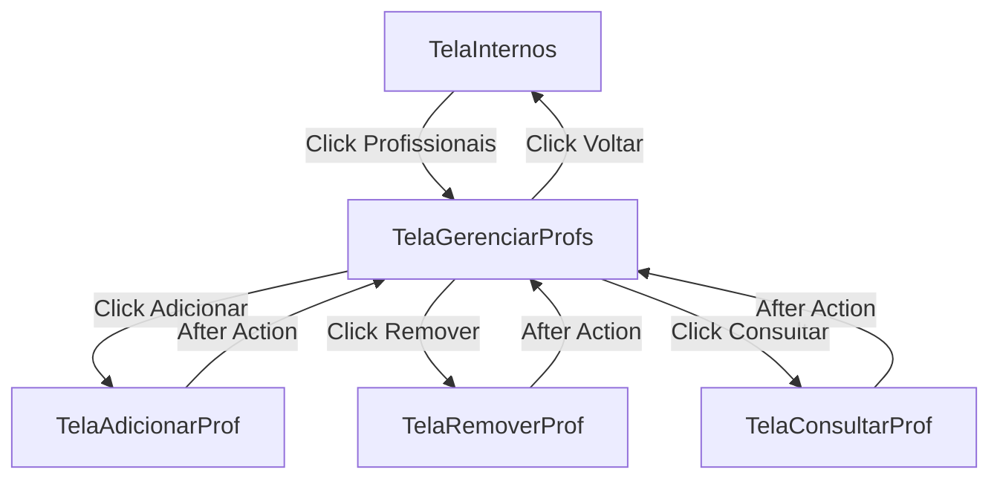

# Design Document: Health Professional Management Feature

## Overview

This feature implements the UI and navigation structure for a health professional management interface in the hospital system. Following the established MVC architecture pattern used in the existing employee management feature, it provides a consistent user experience framework for managing health professional records.

**Important Note:** This initial implementation focuses on creating the screens and navigation routes only. Database operations will be implemented in a future phase.

The implementation consists of:
- A main management controller (GerenciarProfsController) that coordinates navigation
- Four view classes for different screens (management menu, add, remove, query)
- Placeholder methods in the controller for future database integration
- Integration with the existing InternosController for seamless navigation

## Architecture

The feature follows the existing three-tier MVC architecture:

```
┌─────────────────────────────────────────────────────────────┐
│                    Presentation Layer                        │
│  ┌──────────────────┐  ┌──────────────────┐                │
│  │ TelaGerenciarProfs│  │ TelaAdicionarProf│                │
│  └──────────────────┘  └──────────────────┘                │
│  ┌──────────────────┐  ┌──────────────────┐                │
│  │ TelaConsultarProf│  │ TelaRemoverProf  │                │
│  └──────────────────┘  └──────────────────┘                │
└─────────────────────────────────────────────────────────────┘
                            ↕
┌─────────────────────────────────────────────────────────────┐
│                    Controller Layer                          │
│  ┌──────────────────────────────────────────────────────┐   │
│  │         GerenciarProfsController                     │   │
│  │  - Manages view lifecycle                            │   │
│  │  - Handles navigation callbacks                      │   │
│  │  - Coordinates between views and model               │   │
│  └──────────────────────────────────────────────────────┘   │
└─────────────────────────────────────────────────────────────┘
                            ↕
┌─────────────────────────────────────────────────────────────┐
│                      Model Layer                             │
│  ┌──────────────────────────────────────────────────────┐   │
│  │         ProfissionalDAO                              │   │
│  │  - Database connection management                    │   │
│  │  - CRUD operations for health professionals          │   │
│  │  - Query methods for retrieving professional data    │   │
│  └──────────────────────────────────────────────────────┘   │
└─────────────────────────────────────────────────────────────┘
                            ↕
                    PostgreSQL Database
```

### Navigation Flow



## Components and Interfaces

### 1. GerenciarProfsController

**Responsibilities:**
- Initialize and manage the main management view
- Handle navigation between different screens
- Coordinate view lifecycle (destroy old frames, create new ones)
- Pass user session data between controllers

**Key Methods:**
```python
def __init__(self, root: Tk, dados_usuario: dict)
    # Initialize controller with root window and user session data
    
def config_tela_gerenciar_profs_callbacks(self, view: TelaGerenciarProfs)
    # Configure callback functions for view buttons
    
def select_adicionar_prof(self)
    # Navigate to add professional screen
    
def select_remover_prof(self)
    # Navigate to remove professional screen
    
def select_consultar_prof(self)
    # Navigate to query professional screen
    
def voltar(self)
    # Return to internal menu with user session data
```

### 2. View Classes

#### TelaGerenciarProfs
Main management menu with navigation buttons.

**UI Elements:**
- Button: "Adicionar profissional de saúde"
- Button: "Remover profissional de saúde"
- Button: "Consultar informações de profissional"
- Button: "Voltar"

**Methods:**
```python
def __init__(self, root: Tk)
def set_action_adicionar_prof(self, callback)
def set_action_remover_prof(self, callback)
def set_action_consultar_prof(self, callback)
def set_action_voltar(self, callback)
```

#### TelaAdicionarProf
Form for adding new health professionals.

**UI Elements:**
- Entry: CPF (11 characters)
- Entry: Nome (text)
- Dropdown/Radio: Tipo ('M' for Médico, 'E' for Enfermeiro)
- Entry: CRM (9 characters, shown when type is 'M')
- Entry: CODIGO (integer, shown when type is 'E')
- Button: "Adicionar"
- Button: "Voltar"

**Methods:**
```python
def __init__(self, root: Tk, controller)
def get_form_data(self) -> dict
def show_success_message(self, message: str)
def show_error_message(self, message: str)
def clear_form(self)
```

#### TelaRemoverProf
Interface for removing health professionals.

**UI Elements:**
- Entry: CPF (11 characters)
- Button: "Remover"
- Button: "Voltar"
- Label: Status message display

**Methods:**
```python
def __init__(self, root: Tk, controller)
def get_cpf(self) -> str
def show_success_message(self, message: str)
def show_error_message(self, message: str)
def clear_form(self)
```

#### TelaConsultarProf
Interface for querying health professional information.

**UI Elements:**
- Entry: CPF (11 characters)
- Button: "Consultar"
- Button: "Voltar"
- Frame: Results display area (shows name, type, CRM/CODIGO)

**Methods:**
```python
def __init__(self, root: Tk, controller)
def get_cpf(self) -> str
def display_results(self, professional_data: dict)
def show_error_message(self, message: str)
def clear_results(self)
```

### 3. Controller Action Methods (Placeholders)

**Note:** These methods will be implemented as placeholders that log actions without performing actual database operations.

**Placeholder Methods in GerenciarProfsController:**
```python
def handle_adicionar_prof(self, form_data: dict)
    # Log the add action
    # Display success message (placeholder)
    # Future: Call ProfissionalDAO.adicionar_profissional()
    
def handle_remover_prof(self, cpf: str)
    # Log the remove action
    # Display success message (placeholder)
    # Future: Call ProfissionalDAO.remover_profissional()
    
def handle_consultar_prof(self, cpf: str)
    # Log the query action
    # Display placeholder results
    # Future: Call ProfissionalDAO.consultar_profissional()
```

## Data Models

### PROFISSIONAL_SAUDE Table Structure
```sql
CPF CHAR(11) PRIMARY KEY
NOME TEXT NOT NULL
TIPO CHAR(1)  -- 'M' for Médico, 'E' for Enfermeiro
CRM_MED CHAR(9) REFERENCES MEDICO ON DELETE SET NULL
COD_ENF INTEGER REFERENCES ENFERMEIRO ON DELETE SET NULL
```

### Related Tables
- **MEDICO**: Stores CRM identifiers for doctors
- **ENFERMEIRO**: Stores CODIGO identifiers for nurses
- **PROF_SAUDE_HOSP**: Links professionals to hospitals (not modified by this feature)
- **PROF_PROC**: Links professionals to procedures (not modified by this feature)

### Data Validation Rules
1. CPF must be exactly 11 characters
2. Nome must not be empty
3. Tipo must be either 'M' or 'E'
4. If Tipo is 'M', CRM must be provided (9 characters)
5. If Tipo is 'E', CODIGO must be provided (positive integer)
6. CPF must be unique in the database

## Correctness Properties

*A property is a characteristic or behavior that should hold true across all valid executions of a system-essentially, a formal statement about what the system should do. Properties serve as the bridge between human-readable specifications and machine-verifiable correctness guarantees.*

**Note:** Since this phase focuses on UI and navigation only, properties related to database operations will be validated in a future implementation phase. The current implementation will validate navigation and UI properties.

### Property 1: Navigation state preservation
*For any* user session data, navigating from the management interface back to the internal menu should preserve all session data fields and properly clean up the previous screen's resources.
**Validates: Requirements 1.4, 5.5**

### Property 2: Screen transition completeness
*For any* navigation action (clicking add, remove, query, or return buttons), the system should destroy the current frame before creating the new screen to prevent resource leaks.
**Validates: Requirements 5.5**

### Property 3: Action logging completeness
*For any* user action (button click, navigation), the system should create a log entry with appropriate detail level.
**Validates: Requirements 6.3**

### Future Properties (Database Phase)
The following properties will be implemented when database operations are added:
- Professional insertion completeness (Req 2.3)
- Doctor-specific data handling (Req 2.4)
- Nurse-specific data handling (Req 2.5)
- Invalid data rejection (Req 2.6)
- Professional deletion completeness (Req 3.3)
- Cascading deletion integrity (Req 3.4)
- Non-existent professional error handling (Req 3.5, 4.6)
- Professional query completeness (Req 4.3, 4.4, 4.5)
- Database error handling and logging (Req 6.2, 6.4)
- Database connection cleanup (Req 6.5)

## Error Handling

**Note:** Since this phase focuses on UI and navigation only, error handling will be minimal. Comprehensive error handling will be added when database operations are implemented.

### Current Phase Error Handling
1. Log all navigation actions
2. Handle missing user session data gracefully
3. Ensure frames are properly destroyed to prevent UI errors

### Future Error Handling (Database Phase)
When database operations are implemented, we will add:

**Input Validation Errors:**
- Empty or invalid CPF format
- Missing required fields (name, type, CRM/CODIGO)
- Duplicate CPF detection

**Database Operation Errors:**
- Connection failures
- Query/Insert/Delete failures
- Constraint violations

**Error Handling Strategy:**
- Try-except blocks around all database operations
- User-friendly error messages in UI
- Detailed error logging for debugging
- Proper connection cleanup in finally blocks

## Testing Strategy

**Note:** Since this phase focuses on UI and navigation only, testing will be minimal and primarily manual. Comprehensive automated testing will be added when database operations are implemented.

### Manual Testing (Current Phase)
Manual testing will verify:

1. **Navigation Flow**
   - Clicking "Profissionais" from internal menu displays management screen
   - All buttons on management screen navigate to correct screens
   - Return button navigates back to internal menu
   - User session data is preserved across navigation

2. **UI Element Presence**
   - Management screen shows all required buttons
   - Add screen shows all input fields
   - Remove screen shows CPF input field
   - Query screen shows CPF input and results area

3. **Logging**
   - All button clicks are logged
   - All navigation actions are logged
   - Log entries contain appropriate detail

### Future Testing (Database Phase)
When database operations are implemented, we will add:

1. **Unit Testing** using Python's `unittest` framework
   - DAO method testing
   - Input validation testing
   - Error handling testing

2. **Property-Based Testing** using the `hypothesis` library
   - Each property test will run a minimum of 100 iterations
   - Tag format: `# Feature: gerenciar-profissionais, Property {number}: {property_text}`
   - Custom generators for health professional data

3. **Integration Testing**
   - Complete user workflows
   - Database transaction integrity
   - Error recovery scenarios
